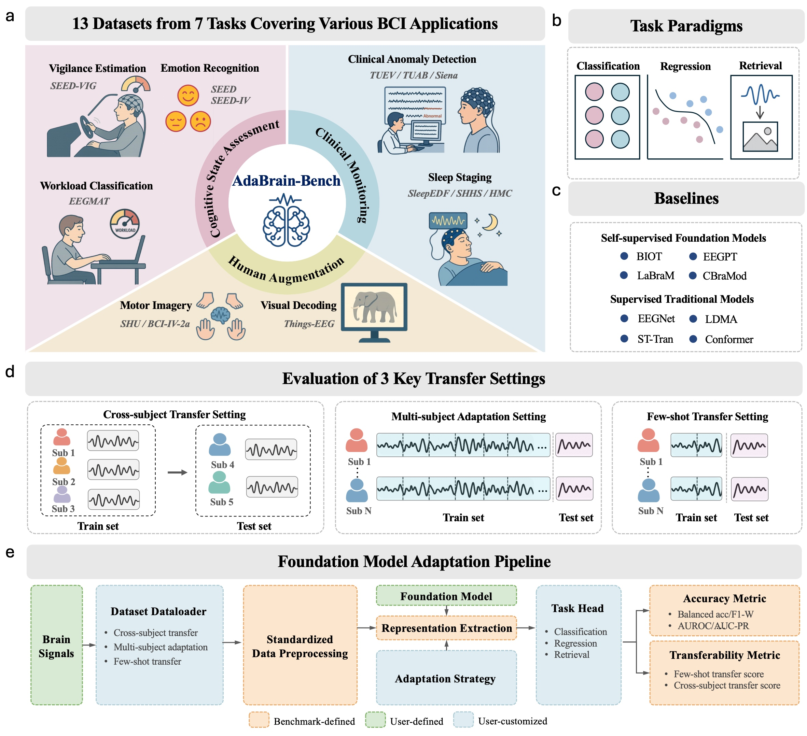

  
# AdaBrain-Bench: Benchmarking Brain Foundation Models for Brain-Computer Interface Applications 

_Jiamin Wu, Zichen Ren, Junyu Wang, Pengyu Zhu, Yonghao Song, Mianxin Liu, 
Qihao Zheng, Lei Bai, Wanli Ouyang, Chunfeng Song_

    

 

AdaBrain-Bench provides code for evaluating EEG foundation models across **13 datasets and 7 tasks**, covering **cognitive state assessment, human augmentation, and clinical monitoring**. It supports diverse task paradigms, including **classification, regression, and retrieval**, with comprehensive evaluation metrics. Additionally, it employs multifaceted evaluation settings including **cross-subject, multi-subject, and few-shot setting** to thoroughly assess models downstream task generalization ability in various scenarios.

The code is coming soon...
